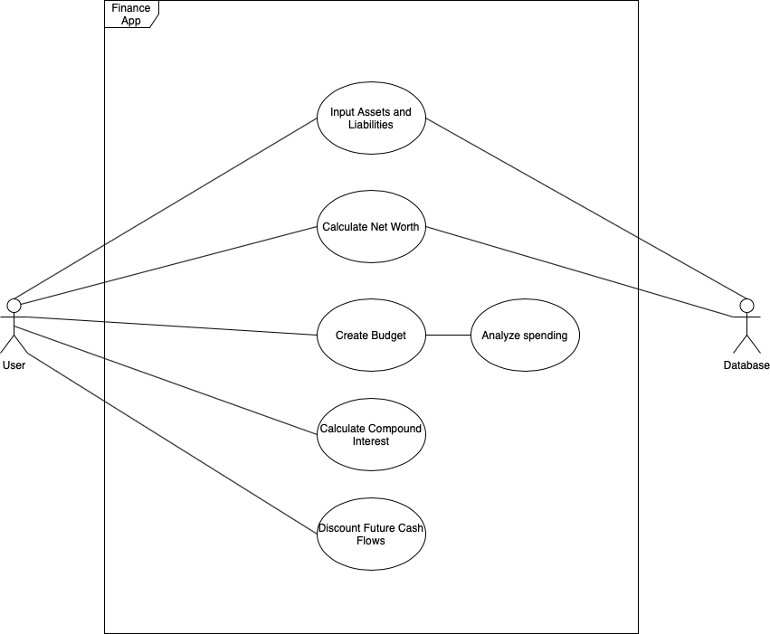

# FinanceAppProjectProposal

## Project Abstract
  The goal of this project will be to create a full stack finance suite, primarily for personal usage. The goal is to create a project with a broad scope, allowing for additional features if time permits. The base feature set will include a budgeting helper which allows you to track and mark expenses in categories as well as analyze expenses, a net worth tracker which allows you to input and track assets and liabilities, and then some financial tools such as a compound interest calculator and a discounted cashflow calculator. 

  
## Project Relevance
  The aim of this project is to be as modular as possible in design to conform with the goals of the course in general. Best practices will be encouraged, such as extensive testing and CI/CD methodology. Ideally, the project will be easy to extend with new feature that can be plugged in as developer time allows and as requested by users. The multiple layers of the software allow for design at all levels, from a frontend website for users to run in a browser, to a backend which interacts with a database and does calculations. This will allow for learning new languages and tools, such as Go, Javascript, and Docker. The importance of a consistent development environment when working in a large team will be emphasized, and this will be carried out by using Docker for all builds and tests.

## Conceptual Design

## Background

https://github.com/qdnov/FinanceAppProjectProposal

### Building and Running

Building is as simple as running "docker-compose build" while in the same directory as the docker-compose.yml file.
Building for the first time and running can be done in a single step with "docker-compose up", otherwise this command will run the docker images that were last built with the build command. Note that the first run might take a while, as the images need to be built and dependencies will be downloaded. Subsequent builds will cache many things, and will thus be faster.

## Required Resources

* It would be helpful (but is not required!)if group members have prior experience with one of: Go, Javascript, Web Development, Backend Development 
* docker and docker-compose
* Go and NodeJS

